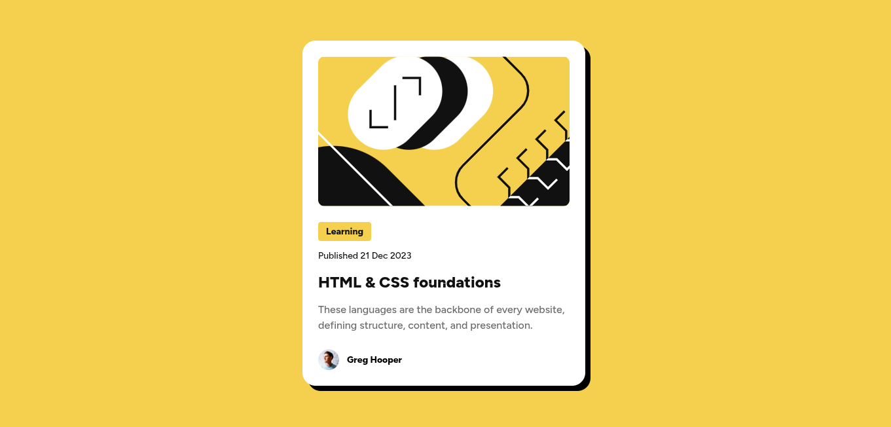

# Frontend Mentor - Blog preview card solution

This is a solution to the [Blog preview card challenge on Frontend Mentor](https://www.frontendmentor.io/challenges/blog-preview-card-ckPaj01IcS). Frontend Mentor challenges help you improve your coding skills by building realistic projects.

## Table of contents

- [Overview](#overview)
  - [The challenge](#the-challenge)
  - [Screenshot](#screenshot)
  - [Links](#links)
- [My process](#my-process)
  - [Built with](#built-with)
  - [What I learned](#what-i-learned)
  - [Continued development](#continued-development)
  - [Useful resources](#useful-resources)
  - [AI Collaboration](#ai-collaboration)
- [Author](#author)
- [Acknowledgments](#acknowledgments)

## Overview

### The challenge

Users should be able to:

- See hover and focus states for all interactive elements on the page

### Screenshot

### Links

- Solution URL: [https://github.com/vibesprint/blog-preview-card](https://github.com/vibesprint/blog-preview-card)
- Live Site URL: [https://vibesprint.github.io/blog-preview-card/](https://vibesprint.github.io/blog-preview-card/)

## My process

### Built with

- Semantic HTML5 markup
- CSS custom properties
- Flexbox

### What I learned

I learned how to import font and set their font-weight and font-style. Also how to put fallback font, which is a good practice.
Used semantic elements, incorporating feedback from previous challenge, and used a little less div.

### Continued development

I would like to focus on html structure and accessibility and css.

### AI Collaboration

Used AI to know about the syntax of different CSS properties.

## Author

- Website - [vibesprint](https://github.com/vibesprint)
